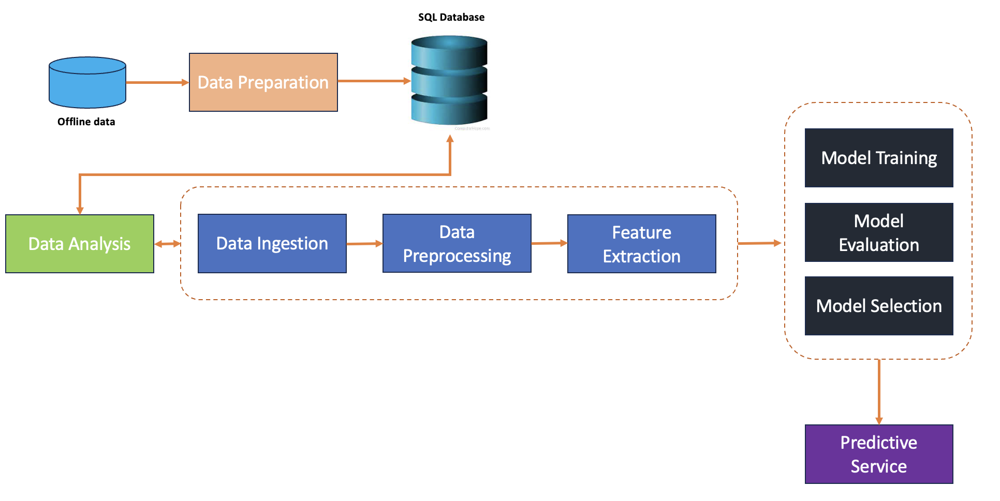
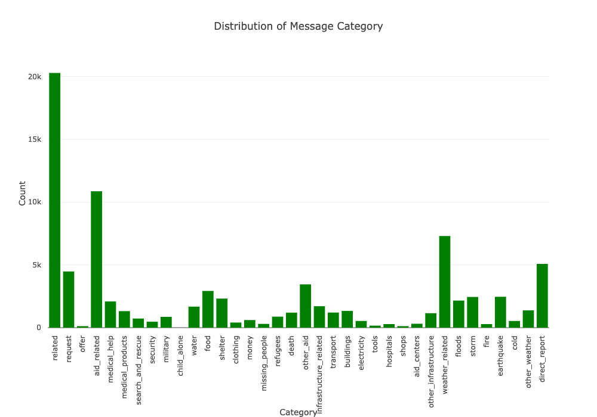
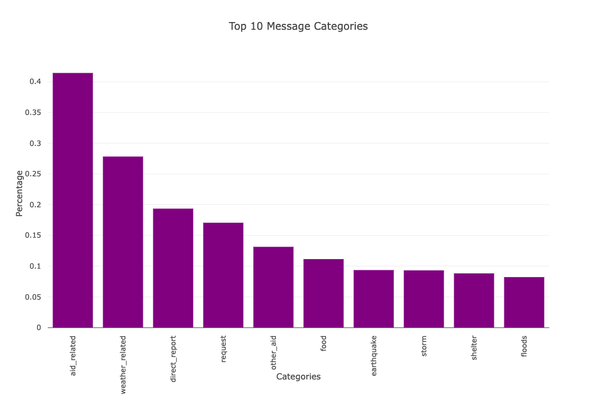
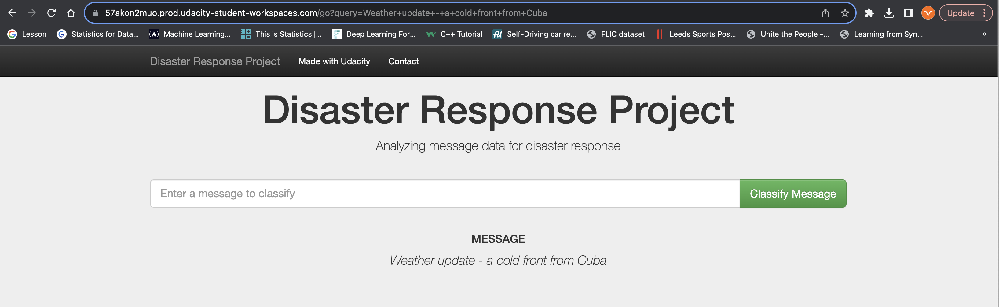

## Project-Disaster-Response-pipeline:
An end-to-end solution to analyze disaster data from Appen and build a predictive Model for an API that classifies disaster messages.


## Description:
This Project is a part of Data Science Nanodegree Program by Udacity in collaboration with Figure Eight. The initial dataset contains pre-labelled tweet and messages from real-life disasters. The aim of this project is to build a Natural Language Processing tool that categorize messages.

**The Project is divided in the following Sections:**
- Building an ETL pipeline to extract, clean and save the data into SQLite Database
- Building a ML pipeline to train Model
- Web Application to show Data Overview and Model Predictions

## Project Pipeline


## Project Structure:
```
- app
| - template
| |- master.html            # main page of web app
| |- go.html                # classification result page of web app
|- run.py                   # Flask file that runs app

- experiments_notebooks
|- ETL Pipeline Preparation.ipynb
|- ML Pipeline Preparation.ipynb

|- run.py                   # Flask file that runs app

- data
|- disaster_categories.csv  # data to process 
|- disaster_messages.csv    # data to process
|- process_data.py
|- InsertDatabaseName.db    # database to save clean data to

- models                    
|- train_classifier.py      # model trainer
|- classifier.pkl           # saved model 

- README.md
```

## Installation:
Use Anaconda distribution of Python 3.6.7.
This will require pip installation of the following:
```
pip install SQLAlchemy
```

```
pip install nltk
```
## Other Required Packages
- Python 3

- ML Libraries: NumPy, Pandas, SciPy, SkLearn

- NLP Libraries: NLTK

- SQLlite Libraries: SQLalchemy

- Model Loading and Saving Library: Pickle

- Web App and Visualization: Flask, Plotly

## Data:
The data in this project comes from Figure Eight - Multilingual Disaster Response Messages. This dataset contains 30,000 messages drawn from events including an earthquake in Haiti in 2010, an earthquake in Chile in 2010, floods in Pakistan in 2010, super-storm Sandy in the U.S.A. in 2012, and news articles spanning a large number of years and 100s of different disasters.

The data has been encoded with 36 different categories related to disaster response and has been stripped of messages with sensitive information in their entirety.

**Data includes 2 csv files:**

- disaster_messages.csv: Messages data.
- disaster_categories.csv: Disaster categories of messages.

       

## Build custom model
To prepare the dataset, follow the below steps.
- Loads the messages and categories datasets
- Merges the two datasets
- Cleans the data
- Stores it in a SQLite database

To prepare trainiing pipeline, follow the below steps.
- train_classifier.py : script write a machine learning pipeline that:
    - Loads data from the SQLite database
    - Splits the dataset into training and test sets
    - Builds a text processing and machine learning pipeline
    - Trains and tunes a model using GridSearchCV
    - Outputs results on the test set

Exports the final model as a pickle file

run.py : Main file to run Flask app that classifies messages based on the model and shows data visualizations.

Link of my git hub repository : https://github.com/Bhardwaj-Saurabh/Project-Disaster-Response-pipeline.git

## Instructions:
Run the following commands in the project's root directory to set up your database and model.
```
git clone  https://github.com/Bhardwaj-Saurabh/Project-Disaster-Response-pipeline.git
```
To run ETL pipeline that cleans data and stores in database
```
python data/process_data.py data/disaster_messages.csv data/disaster_categories.csv data/DisasterResponse.db
```
To run ML pipeline that trains classifier and saves
```
python models/train_classifier.py data/DisasterResponse.db models/classifier.pkl
```
Run the following command in the app's directory to run your web app.
```
python run.py
```
Run the following address into your web-browser
```
http://0.0.0.0:3000/
```
## App Preview
 

## Acknowledgements:
Udacity - Data Science Nanodegree Program

Figure-Eight - dataset

## Author:
Name - Saurabh Bhardwaj

Contact - [LinkedIn](https://www.linkedin.com/in/saurabhbhardwajofficial/)


